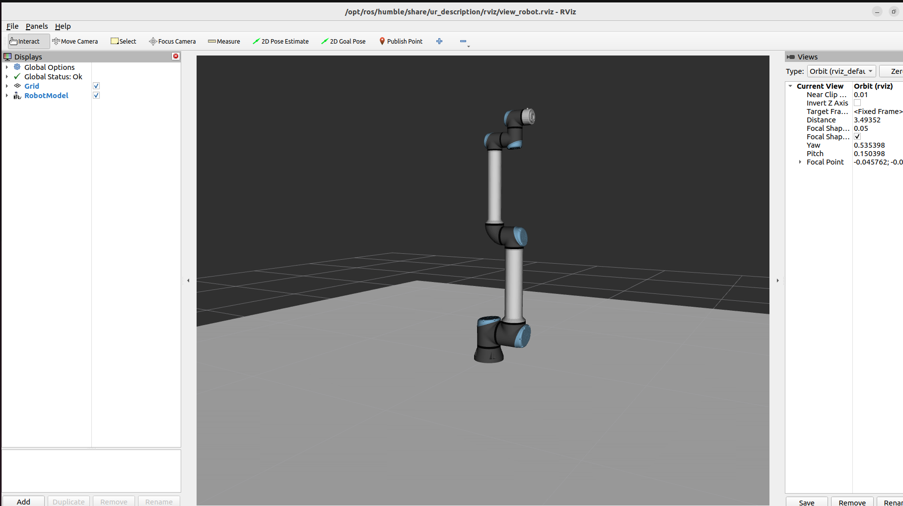

Simulating Robotic Arms in Gazebo
====================================

In this tutorials, we will simulate robotic arms `ur10e <https://www.universal-robots.com/products/ur10e/>`_ in Gazebo simulator.

1. **Install Git**
Open a terminal with ``CTRL+SHIFT+T``, and run

.. code-block:: console

   sudo apt install git

2. **Install Gazebo Fortress**

First install some necessary tools:

.. code-block:: console

   sudo apt-get update
   sudo apt-get install lsb-release gnupg

Then install Ignition Fortress:

.. code-block:: console

   sudo curl https://packages.osrfoundation.org/gazebo.gpg --output /usr/share/keyrings/pkgs-osrf-archive-keyring.gpg
   echo "deb [arch=$(dpkg --print-architecture) signed-by=/usr/share/keyrings/pkgs-osrf-archive-keyring.gpg] http://packages.osrfoundation.org/gazebo/ubuntu-stable $(lsb_release -cs) main" | sudo tee /etc/apt/sources.list.d/gazebo-stable.list > /dev/null
   sudo apt-get update
   sudo apt-get install ignition-fortress

2. **Clone the Repo**

.. code-block:: console

   cd ~/ros2_ws
   git clone -b 0.1.0 https://github.com/UniversalRobots/Universal_Robots_ROS2_GZ_Simulation.git src/ur_simulation_gz
   
3. **Install Dependencies**

.. code-block:: console

   sudo apt-get install ros-humble-ign-ros2-control ros-humble-ros-gz ros-humble-moveit ros-humble-ros2-control ros-humble-ros2-controllers ros-humble-ur-description ros-humble-ur-moveit-config

4. **Build Workspace**

.. code-block:: console

   cd ~/ros2_ws
   colcon build --symlink-install

5. **Try It Out**

Use ``CTRL + ALT + T`` to open a terminal, and type

.. code-block:: console

   ros2 launch ur_simulation_gz ur_sim_control.launch.py ur_type:=ur10e

Close the default dialog and you will see a simulated robotic arm in Gazebo and RVIZ.

